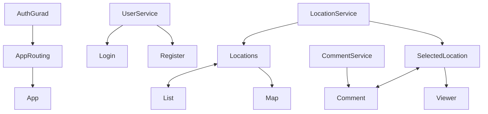

# SZTE Webfejlesztési Keretrendszerek Nagy Beadandó 2023.
## BALATONE - Balatoni Látnivalók Applikáció

### Általános leírás:

Mielőtt fellépsz az oldalra a következőeket érdemes tudnod!

**1. Az oldal használata regisztrációhoz kötött!**  
  - Az oldal Firebase alapon autentikál és tárolja el az adatokat

**2. Bejelentkezés után kapsz egy általános tájékoztatót ami a következőket foglalja össze:**  
  - A főoldal 3 nagy egységre van osztva (fejléc, helyszín lista, térkép)
  - A fejlécről visszanavigálhasz a főoldalra (🏠 ikon), illetve kijelentkezni tudsz (`[->` ikon)
  - A helyszínlista helyszínnevet és helyszínt tartlamaz illetve egy szem ikont (👁️) ezzel tudsz átnavigáli a kiválasztott helyszínre
  - A térkép egy interaktiv OpenStreetMap térkép (hasonló mint a Google Map), ezen böngészni tudsz
  
**3. Adott helyszínre való kattintáskor (👁️ ikon) egy újabb oldalra visz át a program**  
  - Ez is 3 nagy egységre van osztva (fejléc, komment, információ)
  - Adott helyszínhez tudsz kommentelni, módosítani, illetve törölni azt
  - Jobb oldalt információt kapsz az adott helyszínről

### Felépítés:

A projekt MVVM (Model–view–viewmodel) logikát valósít meg.  
A projekt komponens hierarchiája és az adatáramlások iránya a következő.  
(A projekt ennél több komponenst tartlamaz, de a lényegi struktúra a következő):

 

### Hosting URL:
- https://webfejl-beadando-2023.web.app

 

### Saját Pontozás:
| FELADAT | SAJÁT ÉRTÉKELÉS	| PONTSZÁM |
| :--- | :---: | :---: |
| Fordítási hiba nincs	| ✔️ | 1 |
| Futtatási hiba nincs	| ✔️ | 1 |
| Firebase Hosting URL (létezik, és minden végpont megfelelő módon betöltődik)	|✔️|	1 |
| Adatmodell definiálása | 3 DB |	1,5 |
| Alkalmazás felbontása megfelelő számú komponensre (egyetlen komponens TS és HTML kódja sem haladja meg a 250 sort és soronként a 400 karaktert)	|✔️|	1 |
| Reszponzív, mobile-first felület (minden adat látható és jól jelenik meg böngészőben is, mobil nézetben is)	|❌|	0 |
| Legalább 2 különböző attribútum direktíva használata	|✔️|	1 |
| Legalább 2 különböző strukturális direktíva használata	|✔️|	1 |
| Adatátadás szülő és gyermek komponensek között (legalább 1 @Input és 1 @Output)	|✔️|	1 |
| Legalább 10 különböző Material elem helyes használata.	|✔️|	5 |
| Adatbevitel Angular form-ok segítségével megvalósítva (legalább 2)	|✔️|	2 |
| Legalább 1 saját Pipe osztály írása és használata	|✔️|	2 |
| Legalább 2 különböző Lifecycle Hook használata a teljes projektben (értelmes tartalommal, nem üresen)	|✔️|	1 |
| CRUD műveletek mindegyike megvalósult (Promise, Observable használattal)	|✔️|	4 |
| CRUD műveletek service-ekbe vannak kiszervezve és megfelelő módon injektálva lettek	|✔️|	1 |
| Firestore adatbázis használata az adatokhoz (integráció, környezeti változók használata helyes legyen)	|✔️|	1 |
| Legalább 2 komplex Firestore lekérdezés megvalósítása (ide tartoznak: where feltétel, rendezés, léptetés, limitálás)	| ✔️|	4 |
| Legalább 4 különböző route a különböző oldalak eléréséhez	|✔️|	1 |
| Legalább 2 route levédése azonosítással (AuthGuard) (ahol ennek értelme van, pl.: egy fórum témakör megtekinthető bárki számára, de a regisztrált felhasználó adatai nem)	|✔️|	2 |
| Szubjektív pontozás a projekt egészére vonatkozólag (mennyire fedi le a projekt a témakört (mennyire kapcsolódik hozzá), mennyi lehet a befektetett energia a projektben)	|🏖️⛵🌊|	5 |
| **Összpontszám** | ∑ | 40 / 35,5 |

