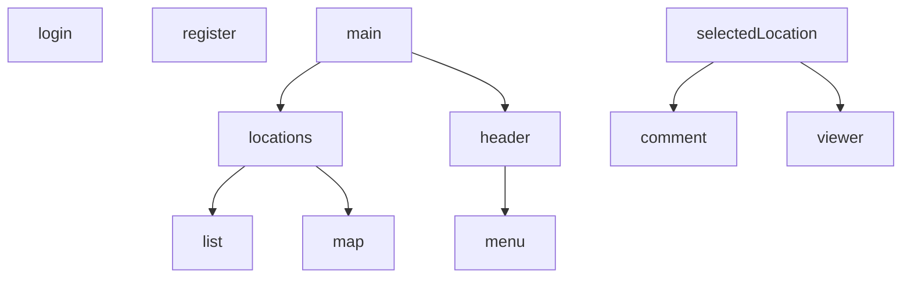

# BALATONE - Balatoni Látnivalók Applikáció
## SZTE Webfejlesztési Keretrendszerek Nagy Beadandó 2023.

**Általános leírás:**

Mielőtt fellépsz az oldalra a következőeket érdemes tudnod!

A projekt komponens hierarchiája a következő:

 

**Hosting URL:**
- https://webfejl-beadando-2023.web.app

 

**Pontozás:**
| FELADAT | SAJÁT ÉRTÉKELÉS	| PONTSZÁM |
| :--- | :---: | :---: |
| Fordítási hiba nincs	| ✔️ | 1 |
| Futtatási hiba nincs	| ✔️ | 1 |
| Firebase Hosting URL (létezik, és minden végpont megfelelő módon betöltődik)	|✔️|	1 |
| Adatmodell definiálása (legalább 4 TypeScript interfész vagy class formájában (ugyanennyi kollekció))	| 3 DB |	1,5 |
| Alkalmazás felbontása megfelelő számú komponensre (egyetlen komponens TS és HTML kódja sem haladja meg a 250 sort és soronként a 400 karaktert)	|✔️|	1 |
| Reszponzív, mobile-first felület (minden adat látható és jól jelenik meg böngészőben is, mobil nézetben is)	|❌|	0 |
| Legalább 2 különböző attribútum direktíva használata	|✔️|	1 |
| Legalább 2 különböző strukturális direktíva használata	|✔️|	1 |
| Adatátadás szülő és gyermek komponensek között (legalább 1 @Input és 1 @Output)	|✔️|	1 |
| Legalább 10 különböző Material elem helyes használata.	|✔️|	5 |
| Adatbevitel Angular form-ok segítségével megvalósítva (legalább 2)	|✔️|	2 |
| Legalább 1 saját Pipe osztály írása és használata	|✔️|	2 |
| Legalább 2 különböző Lifecycle Hook használata a teljes projektben (értelmes tartalommal, nem üresen)	|✔️|	1 |
| CRUD műveletek mindegyike megvalósult (Promise, Observable használattal)	|✔️|	4 |
| CRUD műveletek service-ekbe vannak kiszervezve és megfelelő módon injektálva lettek	|✔️|	1 |
| Firestore adatbázis használata az adatokhoz (integráció, környezeti változók használata helyes legyen)	|✔️|	1 |
| Legalább 2 komplex Firestore lekérdezés megvalósítása (ide tartoznak: where feltétel, rendezés, léptetés, limitálás)	| ✔️|	4 |
| Legalább 4 különböző route a különböző oldalak eléréséhez	|✔️|	1 |
| Legalább 2 route levédése azonosítással (AuthGuard) (ahol ennek értelme van, pl.: egy fórum témakör megtekinthető bárki számára, de a regisztrált felhasználó adatai nem)	|✔️|	2 |
| Szubjektív pontozás a projekt egészére vonatkozólag (mennyire fedi le a projekt a témakört (mennyire kapcsolódik hozzá), mennyi lehet a befektetett energia a projektben)	|🏖️⛵🌊|	5 |
| **Összpontszám** | ∑ | 40 / 35,5 |

